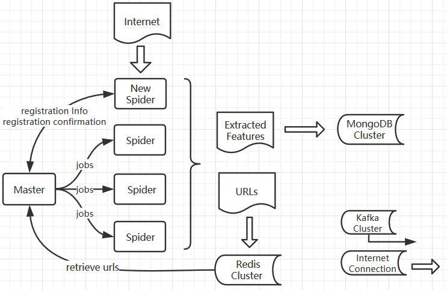
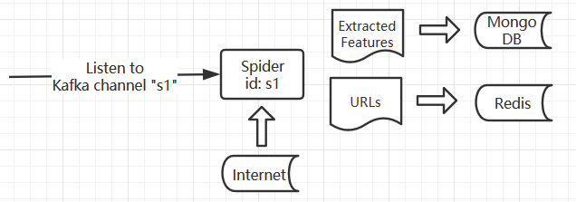
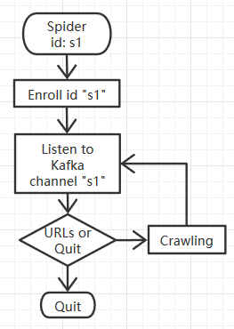
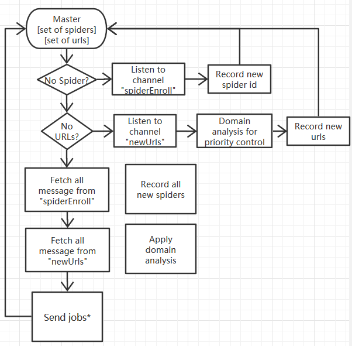

# Midterm Progress Report

**Zi Gu  zigu@usc.edu**

**Haili Wang hailiwan@usc.edu**


### What we built in brief

A distributed web crawler python framework based on Apache Kafka, Redis, Mongo DB and scrapy.


### General Framework Image



### Individual Components 

- Master program
  - Distribute URLs(jobs) to Spiders with care of priority and politeness
  - Only one Master program in total.
- Spiders
  - Listen to Master program, receive jobs, fetch data from Internet, parse data and save data in Redis and Mongo DB.
  - Number of spider almost has no limitation.
- Redis Cluster
  - A in-memory distributed database used to maintain URLs and document fingerprints.
- Mongo DB Cluster
  - A normal distributed No-SQL database used to maintain crawled data from web.
- Kafka Cluster
  - A distributed message queue application used to maintain message connection among individual components.
  - All solid arrows are connection based on Kafka Cluster. Hollow arrows are direct Internet connection.


### How it works overall

1. Run component Master program with configuration of crawling speed, priority information, start URLs.
2. Run component Spider with a unique ID.
3. Spider will send message through Kafka to Master as a registration process.
4. Master distributes jobs to spiders with care of priority and politeness.
5. Spiders receive jobs, analysis content, save new URLs into Redis, save other useful data into Mongo DB.
6. Master will fetch new URLs from Redis and distribute them to spiders again.


### Spider Details - Connection



### Spider Details - Logic



### Master Details - Logic



### Master - Send Jobs Logic

- Distribute URLs to Spiders with care of priority and politeness.
- Data structure Master maintained:
  - A list of domain ordered by priority
  - A set of new URLs fetched from Redis
  - A dictionary with key of domains and values as latest access timestamp
  - A dictionary with key of domains and values as a list of URLs will be sent to Spiders
- Pseudocode:

```
// iterate over domains, maintain priority
for aDomain in priorityList:
	
	// check timestamp of that domain, maintain politeness.
	if not domainAccessable(aDomain):
	
		// aDomain is not accessable, continue next domain.
		continue;
		
	// if new URLs reach a limited number, stop adding new URLs to sendList. Priority
	if maxNumSendlist(sendList):
		break;
		
	// Add limited number of URLs from Redis feching to send waiting list. Maintain politeness
	addWaitingList(aDomain, redisURLs, sendList)
	

```


### Which step we are right now

- Design of framework - Finished

- Implementation of framework - Finished

- Simple individual component testing - Finished

- Full testing with Spider Cluster - Not Yet Finished. Solving Bugs.

  

  